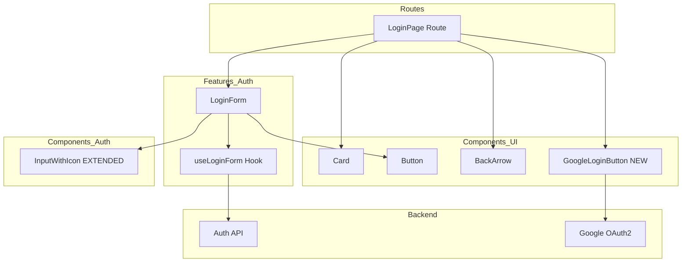
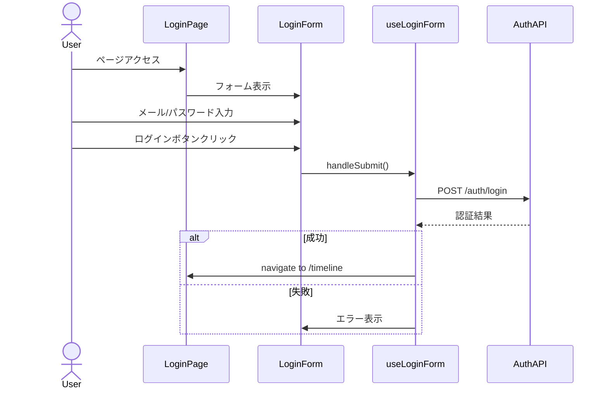
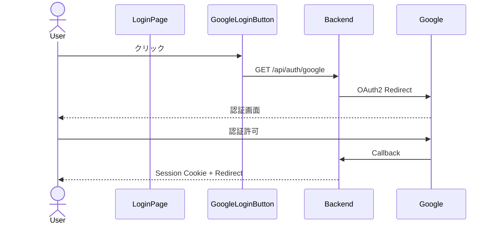

# Design Document: Login Page Redesign

## Overview

**Purpose**: ログインページを参考デザイン（login-sample.png）に基づいてリデザインし、モダンで洗練されたUIを提供する。既存の認証機能（フォームロジック、API連携、Google OAuth2）を維持しつつ、視覚的な刷新を行う。

**Users**: 学校SNSを利用するすべてのユーザー（学生、教師、管理者）がログイン時に使用する。

**Impact**: 既存のログインページコンポーネントのスタイリングを変更し、パスワード表示切替機能とGoogleログインボタンUIを追加する。

### Goals

- 参考デザインに忠実なモダンなUIの実現
- パスワード表示/非表示切替機能の追加
- Googleログインボタンの視覚的導線追加
- 既存認証ロジックの完全な互換性維持

### Non-Goals

- 認証バックエンドの変更（既にGoogle OAuth2実装済み）
- パスワードリセット機能の実装（リンク表示のみ）
- サインアップページのリデザイン（別仕様として対応）
- レスポンシブデスクトップ対応（モバイルファースト維持）

## Architecture

### Existing Architecture Analysis

**現在のアーキテクチャパターン**:

- TanStack Router によるファイルベースルーティング
- features/{domain}/components パターンでドメイン固有UI管理
- TanStack Form + Zod によるフォーム管理・バリデーション
- Hono hc クライアントによる型安全API呼び出し

**維持すべきパターン**:

- `src/routes/auth/login/index.lazy.tsx` がページエントリポイント
- `src/features/auth/login/` 配下にログイン固有コンポーネント・hooks
- `src/components/ui/` に汎用UIコンポーネント
- `useLoginForm` hook による認証ロジック分離

**既存統合ポイント**:

- `/api/auth/login` POST APIエンドポイント
- `/api/auth/google` GET OAuth2開始エンドポイント

### Architecture Pattern & Boundary Map



**Architecture Integration**:

- **Selected pattern**: 既存Extension（コンポーネント拡張 + 限定的新規作成）
- **Domain boundaries**: LoginForm内にフォームロジック集約、GoogleLoginButtonは汎用UIとして分離
- **Existing patterns preserved**: TanStack Form/Query統合、cn()ユーティリティ、lucide-reactアイコン
- **New components rationale**: GoogleLoginButtonはブランドガイドライン遵守のため独立化
- **Steering compliance**: frontend-coding.md規約準拠（Props interface、default export、cn()使用）

### Technology Stack

| Layer    | Choice / Version           | Role in Feature                  | Notes                      |
| -------- | -------------------------- | -------------------------------- | -------------------------- |
| Frontend | React 19 + TanStack Router | ページルーティング・レンダリング | 変更なし                   |
| Styling  | Tailwind CSS v4            | スタイリング刷新                 | インラインカラー記法使用   |
| Icons    | lucide-react 0.545.0       | Eye, EyeOff, Mail, Lock等        | 既存依存、追加アイコン使用 |
| Fonts    | Google Fonts               | Plus Jakarta Sans, Noto Sans JP  | 新規追加                   |
| Form     | TanStack Form + Zod        | フォーム管理・バリデーション     | 変更なし                   |
| API      | Hono hc client             | 認証API呼び出し                  | 変更なし                   |

## System Flows

### ログインフロー（既存維持）



### Googleログインフロー



## Requirements Traceability

| Requirement | Summary                  | Components                      | Interfaces             | Flows                |
| ----------- | ------------------------ | ------------------------------- | ---------------------- | -------------------- |
| 1.1-1.5     | レイアウトと背景デザイン | LoginPage                       | -                      | -                    |
| 2.1-2.6     | ヘッダーとブランディング | LoginPage, BackArrow            | -                      | -                    |
| 3.1-3.5     | メールアドレス入力       | InputWithIcon, LoginForm        | InputWithIconProps     | ログインフロー       |
| 4.1-4.6     | パスワード入力・表示切替 | InputWithIcon, LoginForm        | InputWithIconProps     | ログインフロー       |
| 5.1-5.7     | ログインボタン           | Button, LoginForm, useLoginForm | -                      | ログインフロー       |
| 6.1-6.3     | Googleログインボタン     | GoogleLoginButton               | GoogleLoginButtonProps | Googleログインフロー |
| 7.1-7.3     | 補助リンク               | LoginPage, LoginForm            | -                      | -                    |
| 8.1-8.5     | スタイリングとアイコン   | 全コンポーネント                | -                      | -                    |

## Components and Interfaces

| Component         | Domain/Layer             | Intent                           | Req Coverage                   | Key Dependencies                                              | Contracts |
| ----------------- | ------------------------ | -------------------------------- | ------------------------------ | ------------------------------------------------------------- | --------- |
| LoginPage         | Routes/Auth              | ログインページレイアウト・背景   | 1.1-1.5, 2.1-2.6, 7.2          | LoginForm(P0), Card(P1), BackArrow(P1), GoogleLoginButton(P0) | -         |
| LoginForm         | Features/Auth            | ログインフォームUI・ロジック統合 | 3.1-3.5, 4.1-4.6, 5.1-5.7, 7.1 | InputWithIcon(P0), Button(P0), useLoginForm(P0)               | State     |
| InputWithIcon     | Features/Auth/Components | アイコン付き入力フィールド       | 3.1-3.5, 4.1-4.6               | lucide-react(P0)                                              | Service   |
| GoogleLoginButton | Components/UI            | Googleログインボタン             | 6.1-6.3                        | -                                                             | Service   |
| Button            | Components/UI            | プライマリボタン                 | 5.1-5.2                        | cn(P2)                                                        | -         |
| Card              | Components/UI            | カード型コンテナ                 | 1.4                            | cn(P2)                                                        | -         |
| BackArrow         | Components/UI            | 戻るナビゲーション               | 2.1-2.2                        | TanStack Router(P0), lucide-react(P1)                         | -         |

### Features/Auth/Components

#### InputWithIcon（拡張）

| Field        | Detail                                               |
| ------------ | ---------------------------------------------------- |
| Intent       | アイコン付き入力フィールド（パスワード表示切替対応） |
| Requirements | 3.1-3.5, 4.1-4.6                                     |

**Responsibilities & Constraints**

- 入力フィールドの左側にアイコンを表示
- パスワードタイプ時、右側にEye/EyeOffアイコンを表示（オプショナル）
- 表示切替のクリックイベントを親に委譲

**Dependencies**

- External: lucide-react — アイコン描画（P0）

**Contracts**: Service [x]

##### Service Interface

```typescript
interface InputWithIconProps {
  type: React.HTMLInputTypeAttribute;
  id: string;
  name: string;
  value: string;
  onChange: (e: React.ChangeEvent<HTMLInputElement>) => void;
  placeholder?: string;
  icon: LucideIcon;
  className?: string;
  // 新規追加
  showPasswordToggle?: boolean;
  isPasswordVisible?: boolean;
  onTogglePasswordVisibility?: () => void;
}
```

- Preconditions: `showPasswordToggle`がtrueの場合、`isPasswordVisible`と`onTogglePasswordVisibility`も必須
- Postconditions: パスワード切替時にonTogglePasswordVisibilityが呼ばれる
- Invariants: 既存propsの後方互換性を維持

**Implementation Notes**

- Integration: 既存のInputWithIcon.tsxを拡張、新propsはオプショナル
- Validation: showPasswordToggle使用時はtype="password"または"text"のみ
- Risks: 既存使用箇所への影響なし（新propsはオプショナル）

### Components/UI

#### GoogleLoginButton（新規）

| Field        | Detail                                                             |
| ------------ | ------------------------------------------------------------------ |
| Intent       | Googleアカウントでログインするためのブランドガイドライン準拠ボタン |
| Requirements | 6.1-6.3                                                            |

**Responsibilities & Constraints**

- Googleブランドガイドラインに準拠したデザイン
- `/api/auth/google`へのリンクナビゲーション
- 白背景、ボーダー、Googleロゴ表示

**Dependencies**

- External: なし（静的リンク）

**Contracts**: Service [x]

##### Service Interface

```typescript
interface GoogleLoginButtonProps {
  className?: string;
}
```

- Preconditions: なし
- Postconditions: クリック時に`/api/auth/google`へナビゲート
- Invariants: Googleブランドガイドライン遵守

**Implementation Notes**

- Integration: `<a href="/api/auth/google">`でバックエンドにリダイレクト
- Validation: なし
- Risks: ブランドガイドライン違反回避のため公式SVGロゴ使用

#### Button（スタイリング調整）

| Field        | Detail                     |
| ------------ | -------------------------- |
| Intent       | プライマリアクションボタン |
| Requirements | 5.1-5.2                    |

**Implementation Notes**

- Integration: 既存Buttonのカラーを`bg-[#36454F]`に変更、またはvariant追加
- 既存の`bg-black`スタイルは他画面で使用されているため、ログインページ側で`className`で上書きする方式を推奨

### Routes/Auth

#### LoginPage（スタイリング刷新）

| Field        | Detail                                               |
| ------------ | ---------------------------------------------------- |
| Intent       | ログインページのレイアウト・背景・ブランディング表示 |
| Requirements | 1.1-1.5, 2.1-2.6, 7.2                                |

**Responsibilities & Constraints**

- モバイルファーストレイアウト（max-width: 28rem）
- グラデーション背景効果（ぼかしの円形要素）
- BackArrowの左上配置
- GraduationCapアイコン + ウェルカムテキスト
- 「または」区切り線とGoogleLoginButton配置
- 新規登録リンク

**Dependencies**

- Inbound: なし
- Outbound: LoginForm — フォーム表示（P0）
- Outbound: Card — フォームコンテナ（P1）
- Outbound: BackArrow — 戻るナビゲーション（P1）
- Outbound: GoogleLoginButton — OAuth導線（P0）

**Implementation Notes**

- Integration: 既存`index.lazy.tsx`を全面リデザイン
- Validation: なし
- Risks: 既存レイアウト構造を大きく変更するが、ロジックは維持

### Features/Auth/Login/Components

#### LoginForm（スタイリング刷新）

| Field        | Detail                                     |
| ------------ | ------------------------------------------ |
| Intent       | ログインフォームのUI表示とフォーム状態管理 |
| Requirements | 3.1-3.5, 4.1-4.6, 5.1-5.7, 7.1             |

**Responsibilities & Constraints**

- メール/パスワード入力フィールド配置
- パスワード表示切替状態の管理
- ログインボタンとローディング状態
- パスワードリセットリンク

**Dependencies**

- Outbound: InputWithIcon — 入力フィールド（P0）
- Outbound: Button — 送信ボタン（P0）
- Outbound: useLoginForm — フォームロジック（P0）

**Contracts**: State [x]

##### State Management

- State model: `showPassword: boolean` — パスワード可視性状態
- Persistence: ローカルコンポーネント状態（useState）
- Concurrency: N/A

**Implementation Notes**

- Integration: 既存LoginForm.tsxを更新、showPassword状態を追加
- Validation: useLoginForm内のZodバリデーションを継続使用
- Risks: なし（ロジック変更なし）

## Data Models

本機能はUIリデザインのため、データモデルの変更はありません。

## Error Handling

### Error Strategy

既存のuseLoginFormエラーハンドリングを維持:

- APIエラー時にユーザーへフィードバック表示
- バリデーションエラーはフィールドレベルで表示

### Error Categories and Responses

**User Errors (4xx)**:

- 401 Unauthorized → 「メールアドレスまたはパスワードが正しくありません」

**System Errors (5xx)**:

- 500 Internal Server Error → 「サーバーエラーが発生しました。しばらくしてから再度お試しください」

## Testing Strategy

### Unit Tests

- InputWithIcon: パスワード表示切替ロジック
- GoogleLoginButton: レンダリング、href属性確認

### Integration Tests

- LoginForm: フォーム入力→送信フロー
- パスワード表示切替の状態連携

### E2E/UI Tests

- ログインページ表示確認
- メール/パスワード入力→ログインフロー
- Googleログインボタンクリック→OAuth開始

## Optional Sections

### Security Considerations

- パスワード表示切替は一時的な可視化のみ（状態はメモリ内）
- Googleログインは既存OAuth2フロー（バックエンド実装済み）を使用
- XSS対策: React標準のエスケープ処理を継続適用

### Performance & Scalability

- Google Fonts: `font-display: swap`でFOUC回避
- preconnect使用で接続時間短縮
- 画像アセットなし（アイコンはlucide-react SVG）

## Supporting References

### カラーパレット

| Name       | Hex     | Usage              |
| ---------- | ------- | ------------------ |
| Primary    | #36454F | ログインボタン背景 |
| Background | #F8F8F8 | ページ背景         |
| Text       | #333333 | 本文テキスト       |

### フォント設定

```css
font-family:
  "Plus Jakarta Sans",
  "Noto Sans JP",
  -apple-system,
  BlinkMacSystemFont,
  sans-serif;
```

### Google Fonts埋め込み

```html
<link rel="preconnect" href="https://fonts.googleapis.com" />
<link rel="preconnect" href="https://fonts.gstatic.com" crossorigin />
<link
  href="https://fonts.googleapis.com/css2?family=Noto+Sans+JP:wght@400;500;700&family=Plus+Jakarta+Sans:wght@400;500;600;700&display=swap"
  rel="stylesheet"
/>
```
