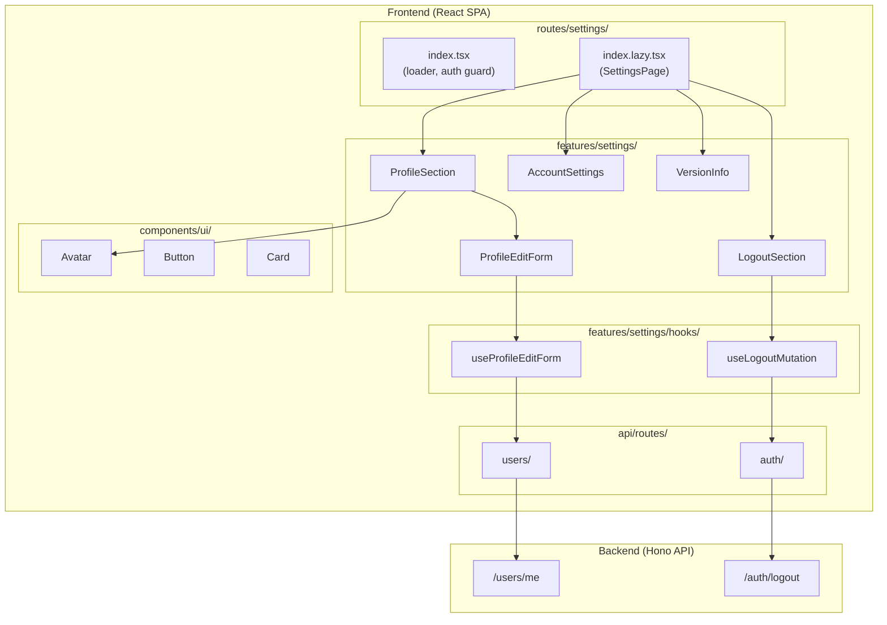

# Design Document: Settings Page

## Overview

**Purpose**: 設定画面は、ユーザーが自分のプロフィール情報を確認・編集し、アカウント設定を管理するための統合インターフェースを提供する。

**Users**: 学生・教師ユーザーが、プロフィールのカスタマイズ、通知/プライバシー設定の管理、ログアウト操作を行う。

**Impact**: 既存の`/settings/`ルートを拡張し、プロフィール表示・編集、アカウント設定、ログアウト機能を統合する。

### Goals

- ユーザーが自分のプロフィール情報を一目で確認・編集できる
- アカウント設定（通知、プライバシー）を直感的に管理できる
- 安全にログアウトできる
- レスポンシブデザインでモバイル・デスクトップ両対応

### Non-Goals

- パスワード変更機能（別画面で対応）
- アカウント削除機能
- 通知/プライバシー設定のバックエンド永続化（UI実装のみ）
- 画像アップロード機能（URL入力で対応）

## Architecture

### Existing Architecture Analysis

**現在のアーキテクチャパターン**:

- Frontend: React + TanStack Router/Query + Tailwind CSS
- Backend: Hono + Prisma + SQLite
- 型共有: hc (hono/client) による型安全なAPI呼び出し

**既存統合ポイント**:

- `GET /api/v2/users/me` - ユーザー情報取得
- `PATCH /api/v2/users/me` - ユーザー情報更新
- `POST /api/v2/auth/logout` - ログアウト
- `useFetchSelfInfoOptions` - ユーザー情報取得hook

**尊重すべきパターン**:

- Feature-First構造 (`features/{domain}/`)
- index.tsx/index.lazy.tsx分離パターン
- TanStack Form + Zod validation

### Architecture Pattern & Boundary Map



**Architecture Integration**:

- **Selected pattern**: Feature-First（既存パターン準拠）
- **Domain boundaries**: `features/settings/`で設定機能を分離
- **Existing patterns preserved**: TanStack Form, Query Keys, Component構造
- **New components rationale**: 設定固有UIはfeaturesに配置、汎用UIは既存components/uiを再利用
- **Steering compliance**: frontend-coding.md準拠

### Technology Stack

| Layer    | Choice / Version           | Role in Feature            | Notes |
| -------- | -------------------------- | -------------------------- | ----- |
| Frontend | React 19 + TanStack Router | ルーティング、認証ガード   | 既存  |
| State    | TanStack Query + Form      | サーバー状態、フォーム管理 | 既存  |
| Styling  | Tailwind CSS v4            | レスポンシブUI             | 既存  |
| Icons    | lucide-react               | 設定アイコン               | 既存  |
| Backend  | Hono                       | API提供                    | 既存  |

## System Flows

### プロフィール編集フロー


### ログアウトフロー


## Requirements Traceability

| Requirement | Summary              | Components                   | Interfaces                           | Flows                  |
| ----------- | -------------------- | ---------------------------- | ------------------------------------ | ---------------------- |
| 1.1-1.5     | プロフィール表示     | ProfileSection, Avatar       | useFetchSelfInfoOptions              | -                      |
| 2.1-2.8     | プロフィール編集     | ProfileEditForm              | useProfileEditForm, PATCH /users/me  | プロフィール編集フロー |
| 3.1-3.5     | アカウント設定       | AccountSettings              | -                                    | -                      |
| 4.1-4.6     | ログアウト機能       | LogoutSection, ConfirmDialog | useLogoutMutation, POST /auth/logout | ログアウトフロー       |
| 5.1-5.2     | バージョン情報       | VersionInfo                  | -                                    | -                      |
| 6.1-6.6     | レスポンシブデザイン | 全コンポーネント             | -                                    | -                      |
| 7.1-7.3     | 認証状態検証         | SettingsRoute                | beforeLoad                           | -                      |

## Components and Interfaces

| Component       | Domain/Layer      | Intent                         | Req Coverage     | Key Dependencies                                                 | Contracts |
| --------------- | ----------------- | ------------------------------ | ---------------- | ---------------------------------------------------------------- | --------- |
| SettingsRoute   | Routes            | 認証ガード、データプリフェッチ | 7.1-7.3          | useFetchSelfInfoOptions (P0)                                     | -         |
| SettingsPage    | Routes            | 設定画面レイアウト             | 6.1-6.6          | ProfileSection, AccountSettings, LogoutSection, VersionInfo (P0) | -         |
| ProfileSection  | Features/Settings | プロフィール表示・編集切替     | 1.1-1.5, 2.1-2.8 | Avatar (P0), ProfileEditForm (P1)                                | State     |
| ProfileEditForm | Features/Settings | プロフィール編集フォーム       | 2.1-2.8          | useProfileEditForm (P0)                                          | Service   |
| AccountSettings | Features/Settings | 通知・プライバシー設定UI       | 3.1-3.5          | -                                                                | State     |
| LogoutSection   | Features/Settings | ログアウトUI                   | 4.1-4.6          | useLogoutMutation (P0), ConfirmDialog (P1)                       | Service   |
| VersionInfo     | Features/Settings | バージョン表示                 | 5.1-5.2          | -                                                                | -         |
| ConfirmDialog   | Features/Settings | 確認ダイアログ                 | 4.2, 4.6         | -                                                                | -         |

### Routes Layer

#### SettingsRoute (index.tsx)

| Field        | Detail                                   |
| ------------ | ---------------------------------------- |
| Intent       | 設定画面の認証ガードとデータプリフェッチ |
| Requirements | 7.1, 7.2, 7.3                            |

**Responsibilities & Constraints**

- beforeLoadで認証状態を検証
- 未認証時は`/auth/login`へリダイレクト
- ユーザー情報をプリフェッチ

**Dependencies**

- Outbound: useFetchSelfInfoOptions — ユーザー情報取得 (P0)
- Outbound: TanStack Router — リダイレクト (P0)

**Contracts**: Service [x]

##### Service Interface

```typescript
// routes/settings/index.tsx
export const Route = createFileRoute("/settings/")({
  beforeLoad: async ({ context }) => {
    try {
      await context.queryClient.ensureQueryData(useFetchSelfInfoOptions());
    } catch (_) {
      throw redirect({ to: "/auth/login" });
    }
  },
});
```

#### SettingsPage (index.lazy.tsx)

| Field        | Detail                                   |
| ------------ | ---------------------------------------- |
| Intent       | 設定画面のメインレイアウトコンポーネント |
| Requirements | 6.1, 6.2, 6.3, 6.4, 6.5, 6.6             |

**Responsibilities & Constraints**

- max-w-mdでコンテンツを中央配置
- 各セクションを縦方向に配置
- Tailwind CSSでレスポンシブスタイリング

**Dependencies**

- Inbound: SettingsRoute — ルーティング (P0)
- Outbound: ProfileSection, AccountSettings, LogoutSection, VersionInfo — UI構成 (P0)

### Features/Settings Layer

#### ProfileSection

| Field        | Detail                                 |
| ------------ | -------------------------------------- |
| Intent       | プロフィール情報の表示と編集モード切替 |
| Requirements | 1.1, 1.2, 1.3, 1.4, 1.5, 2.1           |

**Responsibilities & Constraints**

- ユーザー情報（アバター、名前、bio）を表示
- 編集モードの状態管理
- 未設定値のプレースホルダー表示

**Dependencies**

- Outbound: Avatar — アバター表示 (P0)
- Outbound: ProfileEditForm — 編集フォーム (P1)
- External: useFetchSelfInfoOptions — ユーザーデータ取得 (P0)

**Contracts**: State [x]

##### State Management

```typescript
interface ProfileSectionState {
  isEditing: boolean;
}
```

##### Props Interface

```typescript
interface ProfileSectionProps {
  user: {
    id: string;
    userName: string;
    bio: string | null;
    avatarUrl: string | null;
  };
}
```

#### ProfileEditForm

| Field        | Detail                            |
| ------------ | --------------------------------- |
| Intent       | プロフィール情報の編集フォーム    |
| Requirements | 2.2, 2.3, 2.4, 2.5, 2.6, 2.7, 2.8 |

**Responsibilities & Constraints**

- TanStack Form + Zodでフォーム管理
- アバターURL、自己紹介の編集
- 保存・キャンセル操作

**Dependencies**

- Outbound: useProfileEditForm — フォームロジック (P0)
- Outbound: Button — ボタンUI (P0)

**Contracts**: Service [x]

##### Service Interface

```typescript
// features/settings/hooks/useProfileEditForm.ts
interface UseProfileEditFormOptions {
  initialValues: {
    userName: string;
    bio: string | null;
    avatarUrl: string | null;
  };
  onSuccess: () => void;
  onCancel: () => void;
}

interface UseProfileEditFormReturn {
  form: FormApi<ProfileEditFormValues>;
  isSubmitting: boolean;
}

const useProfileEditForm: (
  options: UseProfileEditFormOptions,
) => UseProfileEditFormReturn;
```

##### Form Schema

```typescript
const profileEditSchema = z.object({
  userName: z.string().min(1, "ユーザー名は必須です"),
  bio: z.string().nullable(),
  avatarUrl: z.string().url().nullable().or(z.literal("")),
});

type ProfileEditFormValues = z.infer<typeof profileEditSchema>;
```

#### AccountSettings

| Field        | Detail                   |
| ------------ | ------------------------ |
| Intent       | 通知・プライバシー設定UI |
| Requirements | 3.1, 3.2, 3.3, 3.4, 3.5  |

**Responsibilities & Constraints**

- 通知設定トグル表示
- プライバシー設定トグル表示
- 設定変更時のローディング表示（UI実装のみ）

**Dependencies**

- なし

**Contracts**: State [x]

##### State Management

```typescript
interface AccountSettingsState {
  notifications: {
    email: boolean;
    push: boolean;
  };
  privacy: {
    profilePublic: boolean;
  };
  isLoading: boolean;
}
```

**Implementation Notes**

- バックエンドAPIは未実装のため、ローカル状態のみで動作
- 将来的にバックエンドスキーマ拡張後にAPI連携

#### LogoutSection

| Field        | Detail                           |
| ------------ | -------------------------------- |
| Intent       | ログアウトボタンと確認ダイアログ |
| Requirements | 4.1, 4.2, 4.3, 4.4, 4.5, 4.6     |

**Responsibilities & Constraints**

- ログアウトボタン表示
- 確認ダイアログ管理
- ログアウトAPIコールとリダイレクト

**Dependencies**

- Outbound: useLogoutMutation — ログアウトAPI (P0)
- Outbound: ConfirmDialog — 確認UI (P1)
- Outbound: Button — ボタンUI (P0)

**Contracts**: Service [x]

##### Service Interface

```typescript
// api/routes/auth/index.ts (追加)
const useLogoutMutation: () => UseMutationResult<void, ApiError, void>;
```

#### VersionInfo

| Field        | Detail                       |
| ------------ | ---------------------------- |
| Intent       | アプリ名とバージョン番号表示 |
| Requirements | 5.1, 5.2                     |

**Responsibilities & Constraints**

- アプリ名を表示
- バージョン番号を表示
- 画面下部に配置

**Dependencies**

- なし

##### Props Interface

```typescript
interface VersionInfoProps {
  appName?: string; // デフォルト: "School SNS"
  version?: string; // デフォルト: package.jsonから取得または固定値
}
```

#### ConfirmDialog

| Field        | Detail                             |
| ------------ | ---------------------------------- |
| Intent       | 確認ダイアログの汎用コンポーネント |
| Requirements | 4.2, 4.6                           |

**Responsibilities & Constraints**

- モーダル表示
- 確認・キャンセルボタン

**Dependencies**

- Outbound: Button — ボタンUI (P0)

##### Props Interface

```typescript
interface ConfirmDialogProps {
  isOpen: boolean;
  title: string;
  message: string;
  confirmLabel?: string; // デフォルト: "確認"
  cancelLabel?: string; // デフォルト: "キャンセル"
  onConfirm: () => void;
  onCancel: () => void;
  isLoading?: boolean;
  variant?: "danger" | "default";
}
```

## Data Models

### Domain Model

設定画面で扱うデータは既存の`User`エンティティを使用。新規エンティティは不要。

```typescript
// 既存: generated/prisma/models/Users.ts
interface User {
  id: string;
  userName: string;
  email: string;
  passwordHash: string;
  role: "ADMIN" | "STUDENT" | "TEACHER";
  bio: string | null;
  avatarUrl: string | null;
  createdAt: Date;
  updatedAt: Date;
}
```

### API Data Transfer

**プロフィール更新リクエスト**:

```typescript
// 既存: routes/users/schema.ts
interface EditUserRequest {
  userName?: string;
  bio?: string | null;
  avatarUrl?: string | null;
}
```

**ユーザー情報レスポンス**:

```typescript
// 既存: routes/users/schema.ts
interface UserDetailResponse {
  id: string;
  userName: string;
  email: string;
  passwordHash: string;
  role: string;
  bio: string | null;
  avatarUrl: string | null;
  createdAt: string;
  updatedAt: string;
}
```

## Error Handling

### Error Categories and Responses

**User Errors (4xx)**:

- 401 Unauthorized → ログインページへリダイレクト
- 400 Bad Request → フィールドレベルバリデーションエラー表示

**System Errors (5xx)**:

- 500 Internal Server Error → 汎用エラーメッセージ「予期しないエラーが発生しました」

**UI Error States**:

- ユーザー情報取得失敗 → エラーメッセージ + 再試行ボタン
- プロフィール更新失敗 → トースト通知でエラー表示
- ログアウト失敗 → トースト通知でエラー表示

## Testing Strategy

### Unit Tests

- `useProfileEditForm`: フォームバリデーション、送信ロジック
- `useLogoutMutation`: ログアウトAPI呼び出し、リダイレクト

### Integration Tests

- ProfileSection: 編集モード切替、フォーム表示
- LogoutSection: ダイアログ表示、ログアウト実行

### E2E Tests

- 設定画面アクセス → プロフィール表示
- プロフィール編集 → 保存 → 反映確認
- ログアウト → ログインページリダイレクト

## Security Considerations

- 認証状態の検証: beforeLoadで未認証ユーザーをリダイレクト
- セッション管理: ログアウト時にCookieを削除
- 入力検証: Zodスキーマでクライアントサイドバリデーション
