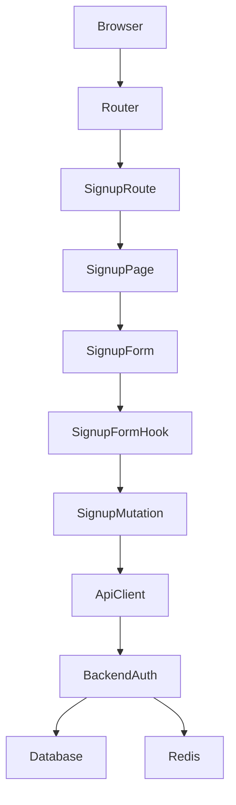
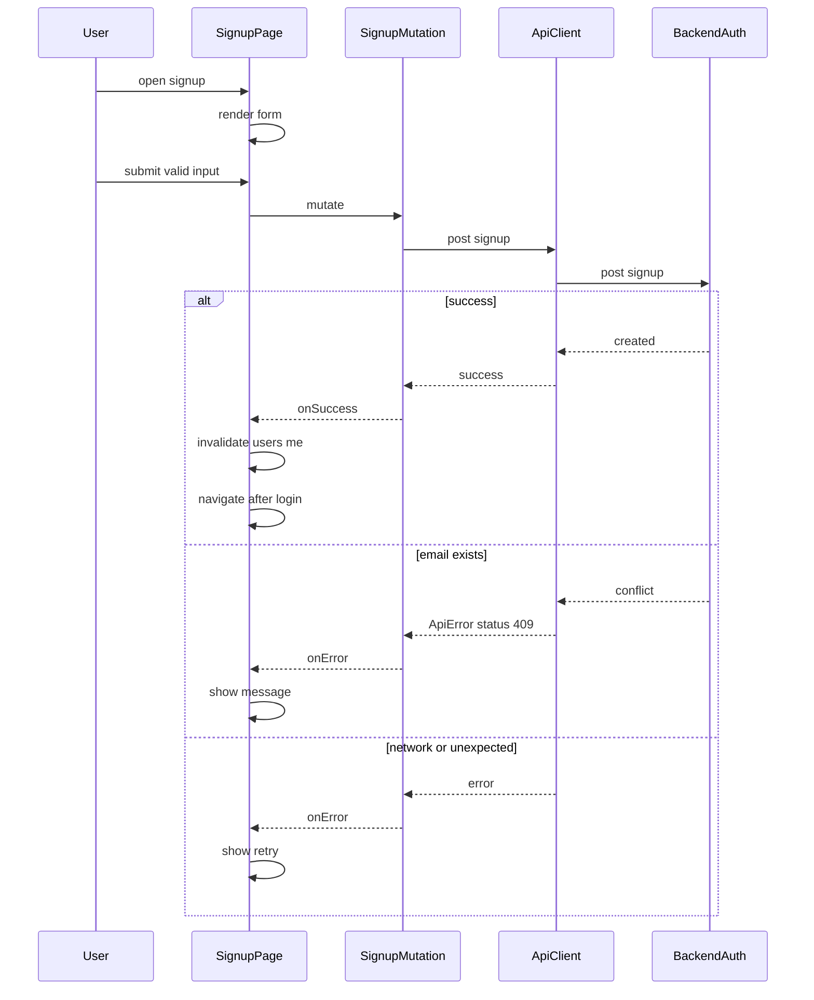

# Design Document

## Overview

本機能は、学校向けSNSアプリケーションに「サインアップ（新規登録）ページ」を追加し、ユーザーがメールアドレス/パスワード（任意で表示名）でアカウント作成できるようにする。

フロントエンドは既存のログインページ実装（TanStack Router + TanStack Form + TanStack Query + 共通UI）を踏襲し、UI/UXの一貫性と実装差分の最小化を優先する。バックエンドは既存の `/api/v2/auth/signup` を利用し、成功時はセッションCookieが確立される前提で「ログイン済み状態」として扱い、ログイン後の既定画面へ遷移する。

### Goals

- サインアップページを `/auth/signup` で提供し、ログインページと相互遷移できる
- 入力のバリデーション（メール形式、パスワード長、表示名長）をクライアント側で実施する
- サインアップ成功/失敗を明確に扱い、成功時はログイン後画面へ遷移する
- 既存のログインページと同等のUI構成を維持する

### Non-Goals

- バックエンドの認証方式/DB設計の変更
- ユーザープロフィール編集（アイコン、自己紹介等）
- Google認証フロー自体の実装変更（UI導線の追加/文言調整は対象）

## Architecture

### Existing Architecture Analysis (if applicable)

- フロントエンドは TanStack Router のファイルベースルーティングを使用しており、ログインページは `app/frontend/src/routes/auth/login/index.lazy.tsx` に実装されている。
- フォームは TanStack Form + Zod で実装され、入力UIは共通コンポーネント（例: `InputWithIcon`）を利用している。
- API呼び出しは `backend/src/createClient` 由来の型安全クライアント（`apiClient.api.v2`）を通じ、Cookie（`credentials: include`）でセッションを扱う。

### Architecture Pattern & Boundary Map

**Architecture Integration**:

- Selected pattern: 既存踏襲（Route + Page + FormHook + MutationHook）
- Domain/feature boundaries: 認証UI（features/auth）にフォーム・ロジックを置き、API呼び出しは `api/routes/auth` に集約する
- Existing patterns preserved: TanStack Router（ルート定義）、TanStack Form（フォームロジック分離）、TanStack Query（Mutation + invalidate）
- New components rationale: サインアップ用フォーム/Mutation/型定義を追加し、ログインと同じ責務分割で統一する
- Steering compliance: `frontend-coding.md` の「feature-first」「hook分離」「型安全（any禁止）」に従う



### Technology Stack

| Layer    | Choice / Version    | Role in Feature                              | Notes                    |
| -------- | ------------------- | -------------------------------------------- | ------------------------ |
| Frontend | React 19            | サインアップ画面のレンダリング               | 既存ログイン画面と同様   |
| Frontend | TanStack Router     | `/auth/signup` ルーティング                  | 既存パターン踏襲         |
| Frontend | TanStack Form + Zod | 入力管理とクライアントバリデーション         | backendのschemaと整合    |
| Frontend | TanStack Query      | サインアップMutation、ユーザー情報invalidate | `usersKeys.me()` を更新  |
| Backend  | Hono                | `/api/v2/auth/signup` を提供                 | 既存APIを利用            |
| Backend  | Prisma + SQLite     | ユーザー永続化                               | スキーマ変更なし         |
| Backend  | Redis               | セッション管理                               | CookieでセッションID保持 |

## System Flows



- 成功時の遷移先は「ログイン後の既定画面」とし、既存のルーティング仕様（`/`がタイムライン等へリダイレクト）に委譲する。

## Requirements Traceability

| Requirement | Summary                             | Components                    | Interfaces | Flows      |
| ----------- | ----------------------------------- | ----------------------------- | ---------- | ---------- |
| 1.1         | `/auth/signup` でページ表示         | SignupRoute, SignupPage       | Router     | -          |
| 1.2         | サインアップ→ログイン導線           | SignupPage                    | Router     | -          |
| 1.3         | ログイン→サインアップ導線           | LoginPage                     | Router     | -          |
| 1.4         | 直接アクセスでも表示可能            | SignupRoute, SignupPage       | Router     | -          |
| 2.1         | 新規登録見出し表示                  | SignupPage                    | UI         | -          |
| 2.2         | ログインと一貫したレイアウト        | SignupPage, Card              | UI         | -          |
| 2.3         | ブランド要素表示                    | SignupPage                    | UI         | -          |
| 2.4         | 狭幅でも操作可能                    | SignupPage                    | UI         | -          |
| 3.1         | email/password入力欄                | SignupForm, InputWithIcon     | UI         | -          |
| 3.2         | name任意入力                        | SignupForm                    | UI         | -          |
| 3.3         | email形式バリデーション             | SignupFormHook                | Service    | -          |
| 3.4         | password長バリデーション            | SignupFormHook                | Service    | -          |
| 3.5         | name長バリデーション                | SignupFormHook                | Service    | -          |
| 4.1         | signup APIへ送信                    | SignupMutation                | API        | SystemFlow |
| 4.2         | 二重送信防止                        | SignupForm, SignupFormHook    | State      | SystemFlow |
| 4.3         | 成功時にログイン後へ遷移            | SignupFormHook, SignupPage    | State      | SystemFlow |
| 4.4         | 409重複を通知                       | SignupFormHook                | State      | SystemFlow |
| 4.5         | ネットワーク/不明失敗の通知と再試行 | SignupFormHook                | State      | SystemFlow |
| 5.1         | Google導線表示                      | SignupPage, GoogleLoginButton | UI         | -          |
| 5.2         | Google認証開始                      | GoogleLoginButton             | API        | -          |
| 5.3         | 成功時にログイン後へ遷移            | （既存挙動に委譲）            | -          | -          |
| 5.4         | 失敗時に通知/再試行                 | （既存挙動に委譲）            | -          | -          |
| 6.1         | 機微情報をエラーに含めない          | SignupFormHook                | State      | -          |
| 6.2         | 機微情報をログ出力しない            | SignupFormHook                | -          | -          |
| 6.3         | 入力欄にラベル/アクセシブル名       | SignupForm, InputWithIcon     | UI         | -          |
| 6.4         | キーボード操作で完了可能            | SignupForm                    | UI         | -          |

## Components and Interfaces

| Component      | Domain/Layer | Intent                                   | Req Coverage                                | Key Dependencies (P0/P1)                  | Contracts      |
| -------------- | ------------ | ---------------------------------------- | ------------------------------------------- | ----------------------------------------- | -------------- |
| SignupRoute    | Router       | `/auth/signup` ルートを提供              | 1.1, 1.4                                    | TanStack Router (P0)                      | -              |
| SignupPage     | UI           | レイアウト・見出し・導線・OAuth導線      | 1.2, 2.1, 2.2, 2.3, 2.4, 5.1                | Card (P0), GoogleLoginButton (P1)         | State          |
| SignupForm     | UI           | 入力欄と送信ボタン、アクセシビリティ     | 3.1, 3.2, 4.2, 6.3, 6.4                     | InputWithIcon (P0), Button (P0)           | State          |
| SignupFormHook | Service      | バリデーション/送信/遷移/エラー分岐      | 3.3, 3.4, 3.5, 4.1, 4.3, 4.4, 4.5, 6.1, 6.2 | SignupMutation (P0), Router navigate (P0) | Service, State |
| SignupMutation | API          | `/auth/signup` へのMutation + invalidate | 4.1                                         | apiClient (P0), usersKeys.me (P0)         | API            |
| auth types     | Shared types | backend schema から型推論                | 3.3, 3.4, 3.5, 4.1                          | backend schema (P0)                       | Service        |

### Frontend / Router

#### SignupRoute

| Field        | Detail                                                                          |
| ------------ | ------------------------------------------------------------------------------- |
| Intent       | `/auth/signup` のルートエントリを提供し、ページコンポーネントをレンダリングする |
| Requirements | 1.1, 1.4                                                                        |

**Responsibilities & Constraints**

- ルート定義のみを担当し、フォームのビジネスロジックを持たない

**Dependencies**

- Outbound: SignupPage — UI表示（P0）

**Contracts**: State [ ]

**Implementation Notes**

- Integration: 既存の`createLazyFileRoute('/auth/signup/')`パターンを踏襲する
- Validation: ルート単体では入力検証を行わない
- Risks: なし

### Frontend / Services (Form Logic)

#### SignupFormHook

| Field        | Detail                                                                                |
| ------------ | ------------------------------------------------------------------------------------- |
| Intent       | サインアップフォームの状態、バリデーション、送信、副作用（invalidate/遷移）を統括する |
| Requirements | 3.3, 3.4, 3.5, 4.1, 4.2, 4.3, 4.4, 4.5, 6.1, 6.2                                      |

**Responsibilities & Constraints**

- Zodにより送信前バリデーションを行う（email形式、password最小長、name最大長）
- 送信中は二重送信を防止する（`isSubmitting`等に連動）
- 失敗時は入力内容を保持し、再試行可能な状態を維持する
- パスワード等の機微情報を `console` 等へ出力しない

**Dependencies**

- Outbound: SignupMutation — signup API呼び出し（P0）
- Outbound: Router navigate — 成功時の遷移（P0）

**Contracts**: Service [x] / State [x]

##### Service Interface

```typescript
import type { SignupRequestBody } from "@/api/routes/auth/type";

type SignupSubmitResult =
  | { type: "Success" }
  | { type: "Failure"; reason: "EmailConflict" | "Network" | "Unknown" };

interface SignupFormService {
  submit(input: SignupRequestBody): Promise<SignupSubmitResult>;
}
```

- Preconditions:
  - `input.email` がメール形式である
  - `input.password.length >= 8`
  - `input.name` が存在する場合 `input.name.length <= 30`
- Postconditions:
  - Success: `usersKeys.me()` がinvalidateされ、ログイン後画面へ遷移が試行される
  - Failure: 入力内容が保持され、ユーザーに再試行可能な形で通知される
- Invariants:
  - 機微情報（password等）をログ出力しない

##### State Management

- State model:
  - `email: string`, `password: string`, `name?: string`
  - `isSubmitting: boolean`
  - `fieldErrors` および `formError`（表示用）
- Persistence & consistency:
  - 画面内状態のみ（ページ遷移しない限り保持）
- Concurrency strategy:
  - `isSubmitting` により送信を直列化し、二重送信を抑止

**Implementation Notes**

- Integration: TanStack Form の `validators.onSubmit` にZodスキーマを渡す
- Validation: バリデーション失敗はフィールド単位のメッセージとして表示する
- Risks: 既存ログインフォームにログ出力があり、同様の誤りを導入する恐れ

### Frontend / API

#### SignupMutation

| Field        | Detail                                                          |
| ------------ | --------------------------------------------------------------- |
| Intent       | サインアップAPIを呼び出し、成功時にユーザー情報クエリを更新する |
| Requirements | 4.1                                                             |

**Responsibilities & Constraints**

- `/api/v2/auth/signup` へPOSTし、失敗時は `ApiError` として扱う
- 成功時に `usersKeys.me()` をinvalidateする

**Dependencies**

- Outbound: apiClient — 型安全APIクライアント（P0）
- Outbound: QueryClient — invalidate（P0）

**Contracts**: API [x]

##### API Contract

| Method | Endpoint              | Request             | Response           | Errors        |
| ------ | --------------------- | ------------------- | ------------------ | ------------- |
| POST   | `/api/v2/auth/signup` | `SignupRequestBody` | `AuthResponseBody` | 409, 400, 500 |

## Data Models

### Data Contracts & Integration

- Request/response は既存の backend Zod schema を単一ソースとして型推論する

```typescript
import type {
  signupSchema,
  authResponseSchema,
} from "backend/src/routes/auth/schema";
import type z from "zod";

export type SignupRequestBody = z.infer<typeof signupSchema>;
export type AuthResponseBody = z.infer<typeof authResponseSchema>;
```

- 本機能ではDBスキーマ変更を行わない

## Error Handling

### Error Strategy

- **入力エラー（バリデーション）**: クライアント側で送信前に検出し、フィールド単位で表示する
- **業務エラー（409重複）**: `ApiError.statusCode === 409` を検出し、「メールアドレスが既に使用されている」等の再入力可能なメッセージを表示する
- **システムエラー（ネットワーク/不明）**: 汎用メッセージを表示し、入力内容は保持したまま再試行可能とする

### Monitoring

- フロントエンド側で機微情報を含むログを出力しない
- 追加の監視基盤導入は本仕様スコープ外

## Testing Strategy

- Unit Tests
  - SignupForm: 必須要素（email/password、任意name、送信ボタン、導線）がレンダリングされる
  - SignupFormHook: バリデーション（email形式、password長、name長）で送信が抑止される
  - SignupFormHook: 409時に EmailConflict として扱われる
- Integration Tests
  - SignupMutation: 成功時に `usersKeys.me()` がinvalidateされる
  - SignupPage: ログイン導線が `/auth/login` を指す
- E2E/UI Tests（可能なら）
  - 正常系: サインアップ成功→ログイン後画面へ
  - 異常系: 重複メール→エラー表示→入力保持

## Optional Sections (include when relevant)

### Security Considerations

- Cookieベースセッション（`credentials: include`）を前提とし、フロントエンドはトークン等の機微情報をローカルに永続化しない
- パスワード等の機微情報をエラーメッセージやログに含めない（特に `console.log` を禁止）
- 入力欄はスクリーンリーダで識別可能なラベル（`sr-only`含む）を提供する

### Performance & Scalability

- 本機能はフォーム送信主体であり、性能要件は既存のページ性能に準拠する

### Migration Strategy

- データ/スキーマ移行は不要
